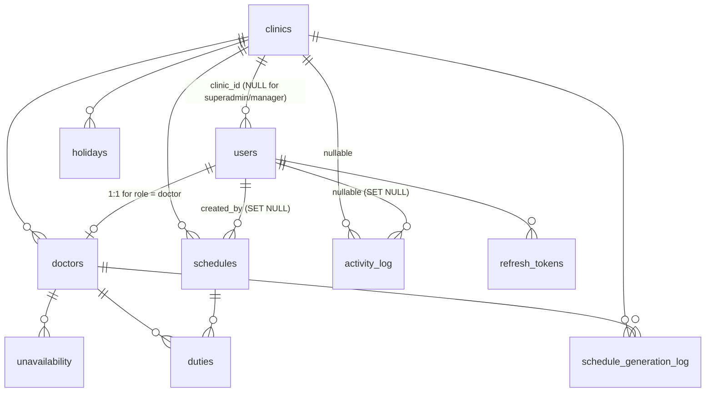

# Database Reference

Explanatory reference for `database/schema.sql`: every table, column, constraint, index, and the behaviors the DDL alone does not show. The DDL in `database/schema.sql` is the source of truth — if this file and the DDL ever disagree, fix this file in the same change.

## Conventions

- PostgreSQL. One idempotent DDL file: `database/schema.sql` (`CREATE TABLE IF NOT EXISTS` + inline `ALTER TABLE ... IF NOT EXISTS` / `DROP ... IF EXISTS` evolutions appended under the owning table). No migration runner exists — never introduce one.
- The file is safe to re-run against a database that already has the current shape. It is **not** a migration path for older shapes: breaking baselines (e.g. the multi-clinic baseline of 2026-09-19) require a reset — `pnpm db:seed:single` / `pnpm db:seed:multi` drop and recreate the database.
- Primary keys: `INTEGER GENERATED ALWAYS AS IDENTITY`.
- Row timestamps: `TIMESTAMPTZ NOT NULL DEFAULT NOW()` (`created_at`, `updated_at`). Calendar days: `DATE`.
- Index naming: `idx_<table>_<cols>`. Uniqueness that must ignore soft-deleted rows is enforced by partial unique indexes (`WHERE is_deleted = FALSE`), not plain `UNIQUE` constraints.
- Application code talks to PostgreSQL through `pg` with parameterized SQL only — never concatenate SQL.
- Enum-like columns are `TEXT` + `CHECK (col IN (...))`. Widening one means drop + re-add the constraint idempotently (see `users_role_check` and `operator_alerts_type_check` in the schema for the pattern).

## Relationships

`app_meta` and `operator_alerts` are standalone (no foreign keys).

## Tables

### `app_meta`

Key/value store for system-level state.

| Column | Type | Constraints |
|---|---|---|
| `key` | TEXT | PRIMARY KEY |
| `value` | TEXT | NOT NULL |
| `updated_at` | TIMESTAMPTZ | NOT NULL DEFAULT NOW() |

Known keys:

| Key | Value | Meaning |
|---|---|---|
| `schema_version` | `'1'` | Schema baseline marker, upserted by both seeds. |
| `billing_paid_through` | `'YYYY-MM-DD'` | Billing lockdown: while `CURRENT_DATE > value`, non-superadmin access is refused (comparison runs in SQL against the database's `CURRENT_DATE`). A missing row means unlocked (`paidThrough` reported as `null`). Seeds insert it 30 days ahead with `ON CONFLICT DO NOTHING` — re-seeding never extends an existing deadline. |
| `open_duty_anchor_date` | `'YYYY-MM-DD'` | Open on-call cycle start: the first open on-call day (seeded `2026-10-02`). A date is an open on-call day when it is the anchor or a whole multiple of the interval after it; earlier dates are closed. Missing/corrupt rows fall back to the seeded default. |
| `open_duty_interval_days` | integer as text | Days between open on-call days (seeded `8`). Administrators edit it via the Rules page (`PATCH /settings/open-duty`); every change is audited as `open_duty_settings.updated`. |

### `clinics`

Multi-clinic tenancy: one hospital per deployment, many clinics.

| Column | Type | Constraints |
|---|---|---|
| `id` | INTEGER | PK, GENERATED ALWAYS AS IDENTITY |
| `name` | TEXT | NOT NULL, UNIQUE |
| `is_active` | BOOLEAN | NOT NULL DEFAULT TRUE |
| `open_duty_slots` | INTEGER | NOT NULL DEFAULT 2, CHECK (`open_duty_slots` >= 1) |
| `closed_duty_slots` | INTEGER | NOT NULL DEFAULT 2, CHECK (`closed_duty_slots` >= 1) |
| `created_at` | TIMESTAMPTZ | NOT NULL DEFAULT NOW() |
| `updated_at` | TIMESTAMPTZ | NOT NULL DEFAULT NOW() |

Clinics are deactivated (`is_active = FALSE`), never deleted.

Behavior:

- `open_duty_slots` / `closed_duty_slots` — on-call doctors per **open** / **closed** on-call day for this clinic (default 2 each). Administrators edit their own clinic's counts from the Rules page (`PATCH /settings/duty-slots`; superadmin names the clinic via `?clinicId=`), audited as `duty_slots_settings.updated` with the clinic id. The service caps each count at the clinic's active doctor count (422 above it); the DB only enforces `>= 1`. The day after an open day is closed but still critical — it uses the closed count. Consumed by the engine, previews, duty edits, publishing, and admin stats.
- Schema evolution: these columns replaced the former deployment-wide `app_meta` keys `open_duty_slots` / `closed_duty_slots`; `schema.sql` copies any stored value to every clinic once and then deletes the keys.

### `users`

Every login account (superadmin, manager, administrator, doctor).

| Column | Type | Constraints |
|---|---|---|
| `id` | INTEGER | PK, GENERATED ALWAYS AS IDENTITY |
| `email` | TEXT | NOT NULL; unique among live rows (`idx_users_email_live`) |
| `username` | TEXT | NOT NULL; `CHECK (username ~ '^[A-Za-z0-9._-]{3,32}$')`; unique among live rows (`idx_users_username_live`) |
| `password_hash` | TEXT | NOT NULL (bcrypt, cost 12) |
| `role` | TEXT | NOT NULL DEFAULT `'doctor'`; CHECK in (`superadmin`, `manager`, `administrator`, `doctor`) |
| `first_name` | TEXT | NOT NULL |
| `last_name` | TEXT | NOT NULL |
| `clinic_id` | INTEGER | FK → `clinics(id)`, nullable |
| `is_active` | BOOLEAN | NOT NULL DEFAULT TRUE |
| `dark_mode` | BOOLEAN | NOT NULL DEFAULT FALSE |
| `is_deleted` | BOOLEAN | NOT NULL DEFAULT FALSE |
| `created_at` | TIMESTAMPTZ | NOT NULL DEFAULT NOW() |
| `updated_at` | TIMESTAMPTZ | NOT NULL DEFAULT NOW() |

Constraints and indexes:

- `users_clinic_role_check`: `administrator`/`doctor` must have `clinic_id IS NOT NULL`; `superadmin`/`manager` must have `clinic_id IS NULL` (hospital/vendor level).
- `idx_users_email_live` — UNIQUE on (`email`) `WHERE is_deleted = FALSE`. The original full-table `users_email_key` constraint is dropped.
- `idx_users_username_live` — UNIQUE on (`username`) `WHERE is_deleted = FALSE`. The original full-table index `idx_users_username` is dropped.
- `idx_users_role` on (`role`) `WHERE is_active = TRUE`.
- `idx_users_clinic` on (`clinic_id`) `WHERE is_deleted = FALSE`.

Behavior:

- Soft delete: deleted accounts get `is_deleted = TRUE` (and always `is_active = FALSE`). The partial unique indexes free their email/username for reuse by a new account.
- Upserts on this table must target the partial index: `ON CONFLICT (email) WHERE is_deleted = FALSE`.
- `dark_mode` is a per-user UI preference applied after sign-in; irrelevant to the API beyond storage.

### `refresh_tokens`

Server-side record of issued refresh tokens (httpOnly cookie). Supports rotation, revocation, and reuse detection.

| Column | Type | Constraints |
|---|---|---|
| `id` | INTEGER | PK, GENERATED ALWAYS AS IDENTITY |
| `user_id` | INTEGER | NOT NULL, FK → `users(id)` ON DELETE CASCADE |
| `token_hash` | TEXT | NOT NULL, UNIQUE (hash of the cookie token — never stored plaintext) |
| `expires_at` | TIMESTAMPTZ | NOT NULL |
| `revoked_at` | TIMESTAMPTZ | nullable (set on logout/revocation) |
| `replaced_by` | INTEGER | FK → `refresh_tokens(id)` ON DELETE SET NULL (rotation chain: old row points to its successor) |
| `created_at` | TIMESTAMPTZ | NOT NULL DEFAULT NOW() |

Indexes: `idx_refresh_tokens_user` (`user_id`); `idx_refresh_tokens_hash` on (`token_hash`) `WHERE revoked_at IS NULL` (active-token lookups; the column-level UNIQUE covers all rows).

### `doctors`

1:1 extension of `users` rows with `role = 'doctor'`; carries scheduling attributes.

| Column | Type | Constraints |
|---|---|---|
| `id` | INTEGER | PK, GENERATED ALWAYS AS IDENTITY |
| `user_id` | INTEGER | NOT NULL, UNIQUE, FK → `users(id)` ON DELETE CASCADE |
| `clinic_id` | INTEGER | NOT NULL, FK → `clinics(id)` |
| `max_monthly_duties` | INTEGER | NOT NULL DEFAULT 7, CHECK between 1 and 7 |
| `created_at` | TIMESTAMPTZ | NOT NULL DEFAULT NOW() |
| `updated_at` | TIMESTAMPTZ | NOT NULL DEFAULT NOW() |

Index: `idx_doctors_clinic` (`clinic_id`).

A doctor row cannot be hard-deleted once it has duties (`duties.doctor_id` is ON DELETE RESTRICT) — doctor accounts are deactivated/soft-deleted instead.

### `unavailability`

Date-range exclusions consumed by the scheduling engine (vacations, absences).

| Column | Type | Constraints |
|---|---|---|
| `id` | INTEGER | PK, GENERATED ALWAYS AS IDENTITY |
| `doctor_id` | INTEGER | NOT NULL, FK → `doctors(id)` ON DELETE CASCADE |
| `start_date` | DATE | NOT NULL |
| `end_date` | DATE | NOT NULL, CHECK (`end_date >= start_date`) |
| `is_disabled` | BOOLEAN | NOT NULL DEFAULT FALSE |
| `created_at` | TIMESTAMPTZ | NOT NULL DEFAULT NOW() |
| `updated_at` | TIMESTAMPTZ | NOT NULL DEFAULT NOW() |

Behavior:

- Ranges are inclusive on both ends: a doctor is unavailable on every `d` with `start_date <= d <= end_date` (see `isAvailable` in `apps/api/src/scheduling/constraints.ts`). A single day is `start_date = end_date`.
- `is_disabled = TRUE` marks a temporarily disabled exclusion: the row is kept but ignored by the scheduler until re-enabled.
- Legacy `type` and `note` columns were dropped — do not reintroduce them.

Indexes: `idx_unavailability_doctor` (`doctor_id`, `start_date`, `end_date`); `idx_unavailability_dates` (`start_date`, `end_date`).

### `holidays`

Per-clinic marked holidays: the scheduling engine treats these dates as Sundays.

| Column | Type | Constraints |
|---|---|---|
| `id` | INTEGER | PK, GENERATED ALWAYS AS IDENTITY |
| `clinic_id` | INTEGER | NOT NULL, FK → `clinics(id)` |
| `holiday_date` | DATE | NOT NULL |
| `created_at` | TIMESTAMPTZ | NOT NULL DEFAULT NOW() |

Constraint: UNIQUE (`clinic_id`, `holiday_date`).

Behavior:

- Marked per clinic and per date — no ranges, no per-doctor scoping.
- The admin API replaces a whole (clinic, year, month) set in one transaction (`PUT /holidays/month`), writing a `holidays.updated` audit entry inside it.
- Seeds insert the default Greek public holidays (Jan 1, Jan 6, Mar 25, Oct 28, Dec 25) for 2026 and 2027 for every clinic, with `ON CONFLICT DO NOTHING`.

Index: `idx_holidays_clinic_date` (`clinic_id`, `holiday_date`).

### `schedules`

One duty schedule per clinic per month.

| Column | Type | Constraints |
|---|---|---|
| `id` | INTEGER | PK, GENERATED ALWAYS AS IDENTITY |
| `clinic_id` | INTEGER | NOT NULL, FK → `clinics(id)` |
| `year` | INTEGER | NOT NULL |
| `month` | INTEGER | NOT NULL, CHECK between 1 and 12 |
| `status` | TEXT | NOT NULL DEFAULT `'draft'`, CHECK in (`draft`, `published`) |
| `created_by` | INTEGER | FK → `users(id)` ON DELETE SET NULL |
| `created_at` | TIMESTAMPTZ | NOT NULL DEFAULT NOW() |
| `updated_at` | TIMESTAMPTZ | NOT NULL DEFAULT NOW() |

Constraint: UNIQUE (`clinic_id`, `year`, `month`).

Behavior: `published` schedules are locked — duty add/reassign/remove and schedule deletion are rejected (409) at the service layer until the schedule is reverted to `draft`.

### `duties`

Individual on-call assignments within a schedule.

| Column | Type | Constraints |
|---|---|---|
| `id` | INTEGER | PK, GENERATED ALWAYS AS IDENTITY |
| `schedule_id` | INTEGER | NOT NULL, FK → `schedules(id)` ON DELETE CASCADE |
| `duty_date` | DATE | NOT NULL |
| `doctor_id` | INTEGER | NOT NULL, FK → `doctors(id)` ON DELETE RESTRICT |
| `is_weekend` | BOOLEAN | NOT NULL (computed by the writer; no default) |
| `reason` | TEXT | NOT NULL (engine's explanation for the assignment) |
| `created_at` | TIMESTAMPTZ | NOT NULL DEFAULT NOW() |

Constraints and indexes:

- `idx_duties_schedule_date_doctor` — UNIQUE on (`schedule_id`, `duty_date`, `doctor_id`): the same doctor cannot appear twice on one day in one schedule, but multiple distinct doctors per day are allowed (up to the day's configured slot count). The older one-duty-per-day constraint (`duties_schedule_id_duty_date_key`) is dropped.
- `idx_duties_schedule` (`schedule_id`); `idx_duties_doctor_date` (`doctor_id`, `duty_date`); `idx_duties_date` (`duty_date`).

Behavior:

- A duty on `duty_date` spans 07:00 → next day 15:00 (overnight, hands off at next day's 15:00).
- Each day's slot count comes from the schedule's clinic (`clinics.open_duty_slots` on open on-call days, `clinics.closed_duty_slots` otherwise; default 2/2); the unique index alone does not cap the count — the engine/service layer does.
- Legacy `is_holiday` denormalized flag was dropped; holiday duties derive from the `holidays` table instead.

### `schedule_generation_log`

Append-only usage metering: one row per doctor included in each generated schedule. Never deleted by schedule deletion or doctor deactivation — it is the billing/audit record.

| Column | Type | Constraints |
|---|---|---|
| `id` | INTEGER | PK, GENERATED ALWAYS AS IDENTITY |
| `doctor_id` | INTEGER | NOT NULL, FK → `doctors(id)` ON DELETE RESTRICT |
| `clinic_id` | INTEGER | NOT NULL, FK → `clinics(id)` |
| `year` | INTEGER | NOT NULL |
| `month` | INTEGER | NOT NULL, CHECK between 1 and 12 |
| `created_at` | TIMESTAMPTZ | NOT NULL DEFAULT NOW() |

Indexes: `idx_schedule_generation_log_doctor` (`doctor_id`, `created_at`); `idx_schedule_generation_log_period` (`year`, `month`); `idx_schedule_generation_log_clinic` (`clinic_id`, `year`, `month`).

The schema contains a one-time backfill: `INSERT ... SELECT DISTINCT` from `duties` joined to `schedules`/`doctors`, guarded by `WHERE NOT EXISTS (SELECT 1 FROM schedule_generation_log LIMIT 1)` — a no-op once the log has rows.

### `operator_alerts`

Alert-only flags visible to the superadmin (vendor). Not user-facing workflow state.

| Column | Type | Constraints |
|---|---|---|
| `id` | INTEGER | PK, GENERATED ALWAYS AS IDENTITY |
| `type` | TEXT | NOT NULL, CHECK in (`disjoint_regeneration`) |
| `detail` | JSONB | NOT NULL |
| `created_at` | TIMESTAMPTZ | NOT NULL DEFAULT NOW() |
| `resolved_at` | TIMESTAMPTZ | nullable |

Index: `idx_operator_alerts_open` (`type`, `resolved_at`).

Behavior:

- `disjoint_regeneration` — raised when the same clinic regenerates the same month with < 50% doctor-pool overlap versus the most recent prior generation of that month. `detail` carries `year`, `month`, `clinicId`, `clinicName`, `previousGeneratedAt`, `previousDoctors`, `overlapPercent`. Deduplicated: at most one unresolved alert per (clinic, month). Two different clinics generating the same month never alert.
- Legacy `allowance_exceeded` rows are deleted by the schema and the type is not in the CHECK — do not reintroduce it.

### `activity_log`

Append-only audit trail of user actions. No update/delete paths exist anywhere in the codebase.

| Column | Type | Constraints |
|---|---|---|
| `id` | INTEGER | PK, GENERATED ALWAYS AS IDENTITY |
| `user_id` | INTEGER | FK → `users(id)` ON DELETE SET NULL |
| `clinic_id` | INTEGER | FK → `clinics(id)`, nullable (NULL for manager/vendor/self-service-without-clinic actions) |
| `action` | TEXT | NOT NULL |
| `entity_type` | TEXT | NOT NULL |
| `entity_id` | INTEGER | nullable |
| `detail` | JSONB | NOT NULL DEFAULT `'{}'` |
| `created_at` | TIMESTAMPTZ | NOT NULL DEFAULT NOW() |

Indexes: `idx_activity_log_user` (`user_id`); `idx_activity_log_clinic` (`clinic_id`); `idx_activity_log_action` (`action`); `idx_activity_log_created_at` (`created_at`).

## Deletion & lifecycle semantics

| Row | How it ends |
|---|---|
| `clinics` | Never deleted — deactivated (`is_active = FALSE`). FKs from `users`/`doctors`/`schedules`/`schedule_generation_log`/`activity_log` have no ON DELETE action, so deletion would be blocked anyway once referenced. |
| `users` | Soft delete (`is_deleted = TRUE`, `is_active = FALSE`). A hard DELETE cascades to `doctors` and `refresh_tokens` and nulls `schedules.created_by` / `activity_log.user_id`, but is RESTRICT-blocked once the doctor row has duties — use soft delete. |
| `doctors` | Deactivated/soft-deleted via the user account. Hard DELETE is RESTRICT-blocked by `duties` and `schedule_generation_log`. |
| `unavailability` | Hard-deleted freely (CASCADE only from its doctor). |
| `holidays` | Hard-deleted freely (replaced wholesale by the month-set API; no FK references this table). |
| `schedules` | Deletable in `draft`; `published` deletion is rejected (409) at the service layer. Deleting cascades to `duties`; `schedule_generation_log` and `operator_alerts` survive. |
| `refresh_tokens` | Expire/revoked; rows cascade on user hard delete. |
| `schedule_generation_log`, `activity_log` | Append-only — never deleted by application flows. |
| `operator_alerts` | Resolved (`resolved_at` set); legacy-type rows purged by schema evolution. |

## Seeds

Both seeds are idempotent upserts applied by `database/scripts/seed.ts`, which first **drops and recreates the database** (reads `DATABASE_URL` from `apps/api/.env`), applies `schema.sql`, then the chosen seed file. All seeded accounts use password `changeme123`.

- `single-clinic.seed.sql` — one clinic (`Main Clinic`), vendor superadmin, one administrator, nine doctors `dr1`–`dr9` (all `max_monthly_duties = 7`). Deterministic pseudo-random unavailability for September 2026 derived from `hashtext(email)`; dr3's and dr8's exclusions are seeded `is_disabled = TRUE`. Seeds the default Greek public holidays (Jan 1, Jan 6, Mar 25, Oct 28, Dec 25) for 2026 and 2027 (`ON CONFLICT DO NOTHING`). Sets `billing_paid_through` 30 days ahead (`ON CONFLICT DO NOTHING`).
- `multi-clinic.seed.sql` — six clinics (Cardiology A/B, Neurology A/B, Radiology A/B), vendor superadmin, one hospital-wide manager, one administrator per clinic, ten doctors per clinic (`dr1`–`dr60`). Fixed unavailability: dr1 Sep 7–11, dr2 Sep 15. Same default holiday seeds (all six clinics) and the same billing seed behavior.

## Evolving the schema

1. Change `database/schema.sql` idempotently: new tables via `CREATE TABLE IF NOT EXISTS`; new columns via `ALTER TABLE ... ADD COLUMN IF NOT EXISTS`; constraint changes via `DROP ... IF EXISTS` + re-add; keep the canonical `CREATE TABLE` in the same file consistent with the evolutions.
2. Update this file (`docs/database.md`) in the same change — tables, columns, indexes, behaviors, deletion semantics.
3. Update the seeds if the change affects seeded shape.
4. Re-run `pnpm db:seed:single` (or `db:seed:multi`) and the full test suite.
